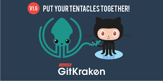
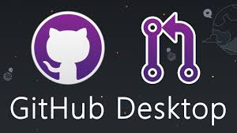

## GitKraken: A Powerful Git GUI for Developers

For developers who use Git, managing code repositories can be a challenging task. Git is a powerful tool, but its command-line interface can be intimidating for beginners. That's where GitKraken comes in. GitKraken is a graphical user interface (GUI) for Git that makes it easier to manage your code. In this article, we'll explore the benefits of using GitKraken for code management.

## What is GitKraken?

GitKraken is a powerful Git GUI that provides a visual representation of your Git repository. It is designed to make Git easier to use for both beginners and experienced developers. The app provides a graphical interface for Git, which makes it easier to visualize changes and collaborate with other team members.

## Benefits of GitKraken

1. User-Friendly Interface
   GitKraken has a user-friendly interface that makes it easy to manage Git repositories. You don't need to be a Git expert to use it. The app provides an intuitive visual representation of your code changes, making it easy to understand and manage. The app also provides a drag-and-drop interface for managing files, which makes it easy to add or remove files from your repository.
2. Simplifies Collaboration
   Collaborating with other team members is essential in software development. GitKraken simplifies collaboration by providing an easy way to create, manage, and share Git repositories. The app provides a simple interface for creating branches, merging changes, and resolving conflicts. This makes it easier for team members to work together on a project.
3. Multi-Platform Support
   GitKraken supports multiple platforms, including Windows, macOS, and Linux. This means that developers can use the app on their preferred operating system without worrying about compatibility issues. The app also integrates with popular code editors, such as Visual Studio Code and Atom, making it easy to manage your code within your favorite editor.

4. Integration with GitHub
   GitHub is a popular code hosting platform used by developers to store and share their code. GitKraken integrates seamlessly with GitHub, allowing you to easily push your changes to your GitHub repository. This makes it easier to manage your code and collaborate with other developers on GitHub.
5. Advanced Features
   GitKraken offers several advanced features that make it a powerful tool for managing Git repositories. The app provides a powerful search function that allows you to search for files, commits, and branches. It also provides a code review feature that makes it easy to review and approve changes made by other team members. Additionally, the app provides a Git flow feature that simplifies the Git branching model.
### Conclusion
GitKraken is a powerful Git GUI that simplifies code management, makes collaboration easier, and supports multiple platforms. The app has a user-friendly interface that makes it easy to use for both beginners and experienced developers. It also integrates seamlessly with GitHub and provides advanced features that make it a powerful tool for managing Git repositories. If you're looking for an easy way to manage your code and collaborate with other team members, GitKraken is definitely worth trying.

